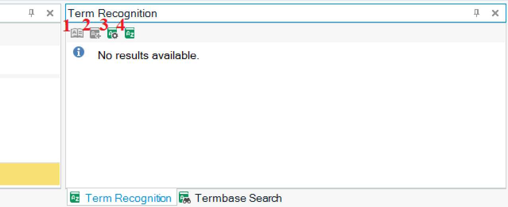
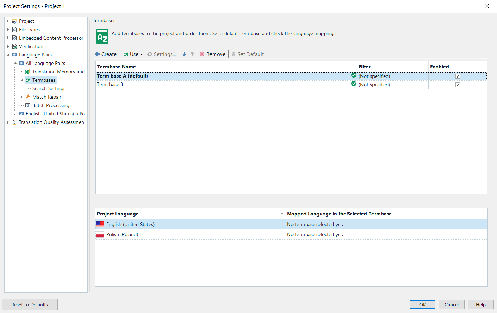
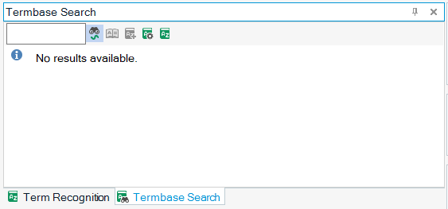

# **What are term bases in CAT tools**

In CAT tools, term bases are databases that consist of pairs of multilingual terms stored in a list. They work like glossaries - you can access them when your translation requires it.

Term bases are often used to enforce terminology (words and phrases) that translators are *required* to translate in a particular way.

# **Term bases in memoQ translator pro**

To go to the Term bases section, open a project and click *Translation memories* on the left side of the screen. Then, on the top part of the screen, you can:

- click *Create/Use New* to create a new term base to be used in the project 
- click *Register Local* to register a local term base for memoQ to use in projects (the preferred file formats are .mtb and .xml)
- click *Properties* to display the properties of the selected term base
- click *Delete* to delete the selected term base
- click *Use In Project* to use the selected term base in a particular project
- once you have done that, to remove the selected term base from a particular project, click *Remove From Project*
- click *As Target For New Terms* to set the selected term base as the target for new terms - terms added with the Quick Add (Ctrl+Q) command will be added there
- click *Raise Rank* to raise the rank of the selected term base, which affects how term bases are displayed
- conversely, click *Lower Rank* to lower the rank of the selected term base
- click *Edit* to open and edit the selected term base
- click *Import Terminology* to import a file (.csv, .txt, .tsv, .tmx, .xls, .xlsx, .xml, or .tbx)
- click *Export Terminology* to export the selected term base to a .csv, .xlsx, or .xml file
- click *Repair Resource* to repair the term base to improve lookup speed
- click *Synchronize Online* to synchronise the term base by creating or updating a local copy

# **Term bases in Trados Studio**

Open a text file. In the upper right corner of the Editor section you can see the Term Recognition section. There you can:

- click the first icon to view term details of the selected the term base
- click the second icon to insert term translations
- click the third icon to configure the hitlist settings
- click the fourth icon to configure the term base settings 

Here you can:

- click *Create* to a create a new file-based term base
- click *Use* to open a file-based term base (the preferred file types are .sdltb and .mdb), a server-based term base, or a cloud-based terminology
- click *Settings* to configure the settings of the term base
- click the arrows to move the term bases up and down
- clcik *Remove* to remove the selected term base
- click *Set default* to set the selected term base as the default one

Apart from the Term Recognition section, you can also go to the Termbase Search section to search for particular items.

## **Links**

[Term bases in memoQ translator pro](https://docs.memoq.com/current/en/Things/things-term-bases.html)