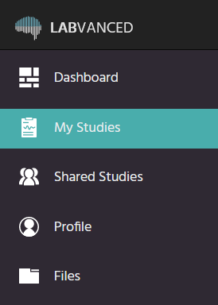
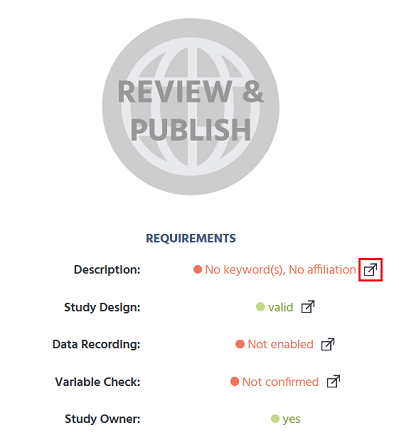

Go to the [Labvanced homepage](https://www.labvanced.com/) and log in. On the menu on the left-hand side, click **My Studies**.

You should see the list of your studies. Double-click on the study you want to publish and record. Next, click **Publish & Record** on the left-hand side menu.

Now you should see the requirements to publish and record a study. By default, the study design is valid, and you are its owner. To fulfil the requirements, first, click on the icon next to **Description: No keyword(s), No affiliation**.

In this section, you need to do two things:
1. Add at least one keyword. To do it, click on the keyword that you want to add in the drop-down menu in the **Keywords** section.
2. In the **Author or Affiliation** section, write your name or the name of the institution you are affiliated with.

Here, you can also set the minimum and maximum duration of your study and give it a description. However, that is not obligatory.

Next, return to the **Publish & Record** section. Click on the icon next to **Variable Check: Not confirmed**.

All you need to do here is click the button to confirm variables.

Next, once again return to the **Publish & Record** section. Click on the icon next to **Data Recording: Not enabled**.

Here, click the button to enable recordings. 

Next, return to the **Publish & Record** section. Click the button to review and publish your study.

