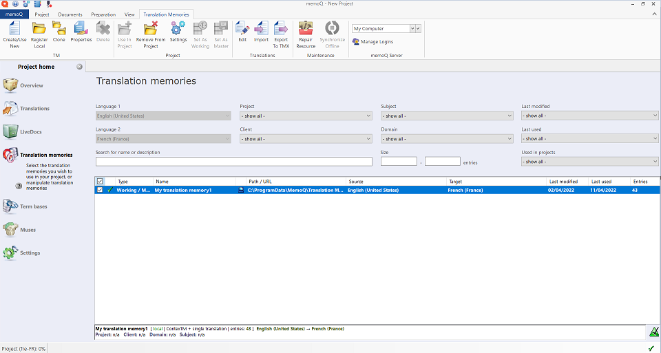
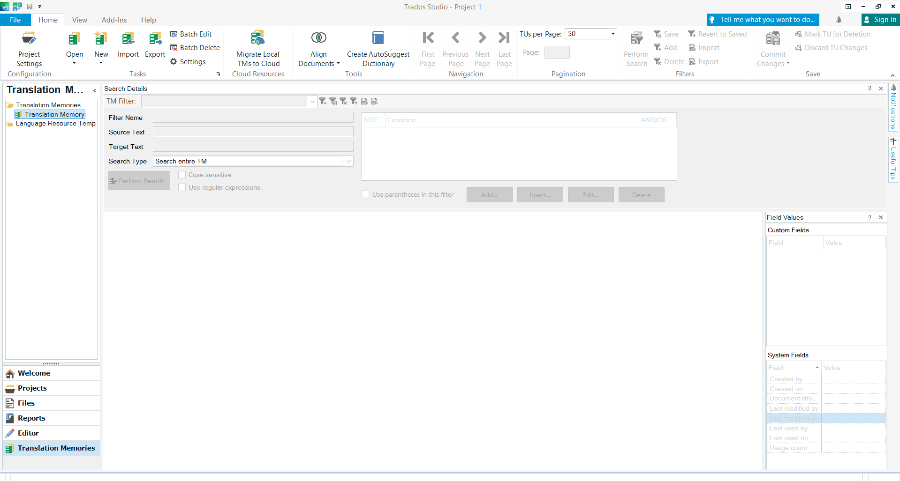

# **What are translation memories in CAT tools**

In CAT tools, translation memories are databases that consist of stored segments of translated texts. Each entry in a translation memory includes a pair of the original text and its translation.

When you open a new document in a CAT tool, the translation memory checks if any part of the text has already been translated, looking for an identical or almost identical match.

It is especially useful for these types of translation that contain a lot of the same sentences and phrases. They make the translation process much faster and more efficient. The suggestions from translation memories can be either accepted or rejected.

Translation memories are built on the basis of a translator's completed translations.

# **Translation memories in MemoQ Translator Pro**

To go to the Translation memories section, open a project and click *Translation memories* on the left side of the screen. Then, on the top part of the screen, you can:

- click *Create/Use New* to create a new translation memory to be used in the project 
- click *Register Local* to register a local translation memory for MemoQ to use in projects (the preferred file format is .mtm)
- click *Clone* to make a copy of the selected translation memory
- click *Properties* to display the properties of the selected translation memory
- click *Delete* to delete the selected translation memory
- click *Use In Project* to use the selected translation memory in a particular project
- once you have done that, to remove the selected translation memory from a particular project, click *Remove From Project*
- click *Settings* to display the settings on how the selected translation memory will be used in a particular project
- click *Set As Working* to set the selected translation memory as the working translation memory, where all new translations are stored when the translator or reviewer confirms a translated segments
- click *Set As Master* to set the selected translation memory as the master translation memory, where MemoQ stores translation during the Confirm And Update Rows operation
- click *Edit* to open and edit the selected translation memory
- click *Import* to import a file (.csv, .txt, .tsv, .tmx, or .sdltm)
- click *Export to TMX* to export the selected translation memory to a .tmx file
- click *Repair Resource* to repair the translation memory to improve lookup speed
- click *Synchronize Online* to synchronise the translation memory by creating or updating a local copy

# **Translation memories in Trados Studio 2021**

To go to the Translation memories section, click *Translation Memories* on the left side of the screen. Then, on the top part of the screen, you can:

- click *Project Settings* to configure your project
- click *Open* to open a new translation memory (an .sdltm file), a server-based translation memory, or a language resource template
- click *New* to create a new translation memory (an .sdltm file), a server-based translation memory, or a language resource template
- click *Import* to import a translation memory (.tmx, tmx.gz, .sdlxliff, .ttx, .itd, or .sdlalign)
- click *Export* to export a selected translation memory to a .tmx file
- click "Migrate Local TMs to Cloud* to migrate a local translation memory to a cloud server
- click *Align Documents* to select a translation memory and the documents (a single file pair or multiple files) to align, or to open an alignment file (.sdlalign)
- click *Create AutoSuggest Display* to select a translation memory and create a new AutoSuggest dictionary
- click *Commit Changes* to commit pending changes to a particular translation memory

## **Links**

[Translation memory settings in MemoQ Translator Pro](https://docs.memoq.com/current/en/Things/things-tm-settings.html)
