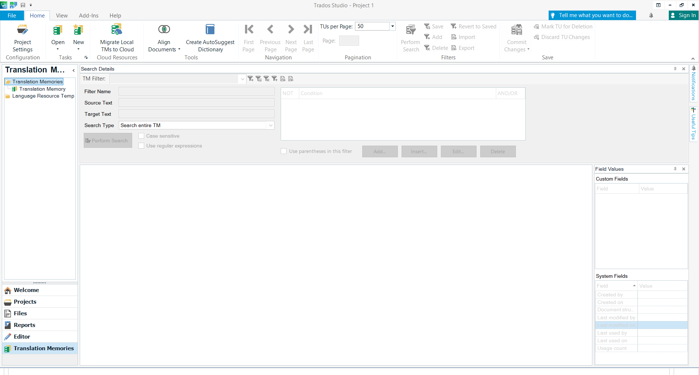

# **What are translation memories in CAT tools**

In CAT tools, translation memories are databases that consist of stored segments of translated texts. Each entry in a translation memory includes a pair of the original text and its translation.

When you open a new document in a CAT tool, the translation memory checks if any part of the text has already been translated, looking for an identical or almost identical match.

It is especially useful for these types of translation that contain a lot of the same sentences and phrases. They make the translation process much faster and more efficient. The suggestions from translation memories can be either accepted or rejected.

Translation memories are built on the basis of a translator's completed translations.

# **Translation memories in MemoQ Translator Pro**

   

# **Translation memories in Trados Studio 2021**

   

## **Links**

[Translation memory settings in MemoQ Translator Pro](https://docs.memoq.com/current/en/Things/things-tm-settings.html)
