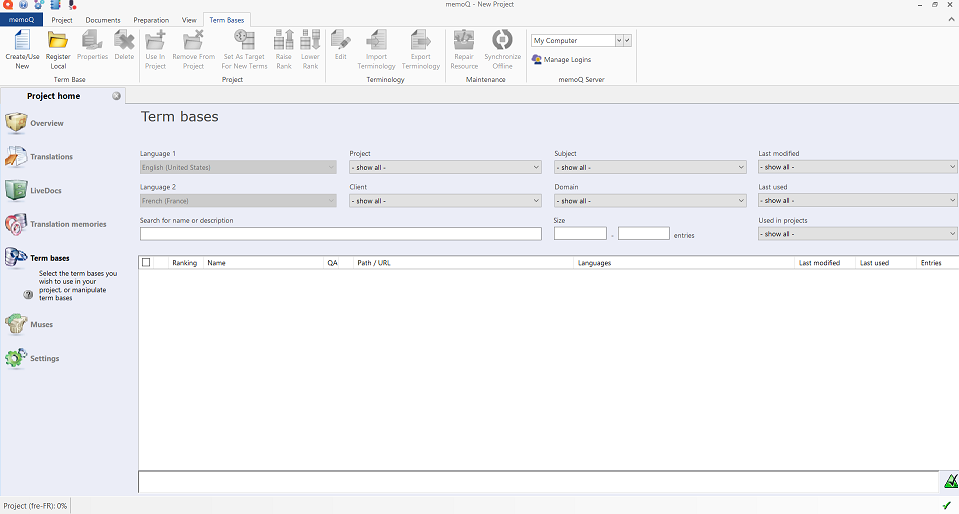
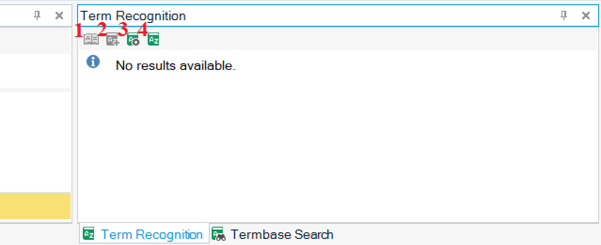

# **What are term bases in CAT tools**

In CAT tools, termbases are databases that consist of pairs of multilingual terms stored in a list. They work like glossaries - you can access them when your translation requires you to do so.

Term bases often include specific words and phrases that the you are *required* to translate in a particular way.

# **Term bases in MemoQ Translator Pro**

Text to be added

# **Term bases in Trados Studio 2021**

Text to be added

## **Links**

[Term bases in MemoQ Translator Pro](https://docs.memoq.com/current/en/Things/things-term-bases.html)