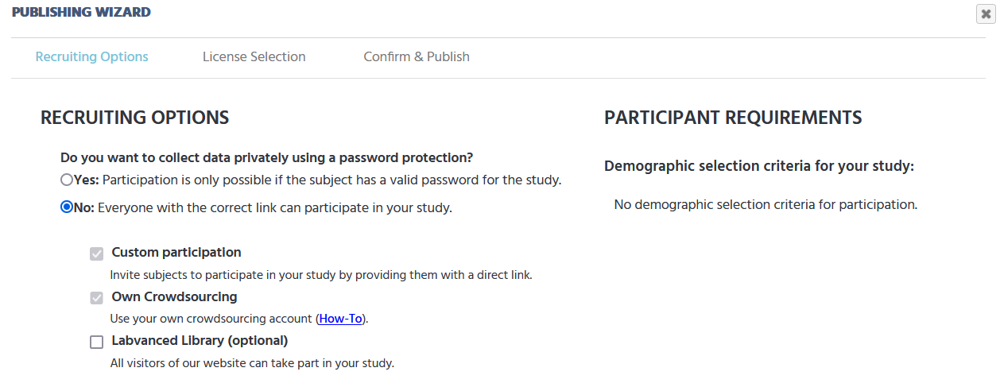
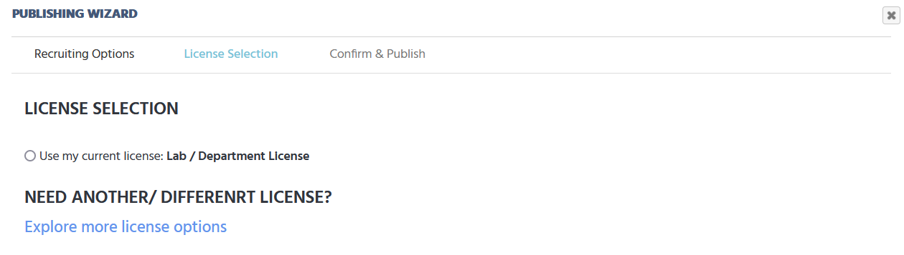
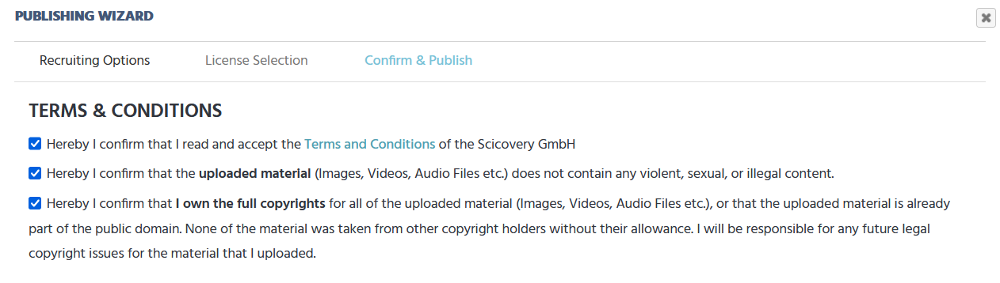
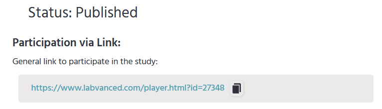

You should see a publishing wizard with three sections. In the **Recruiting options** section, you can decide if you want to use a password protection for your study.

Click the **Next** button. Now you are in the **License Selection** section. Here, you need to select **Use my current license: Lab/Department License**. To browse other options, you can also click **Explore more license options**.

Click the **Next** button. Now you are in the **Confirm & Publish** section. Here, you need to accept all three terms and conditions. Then, click the **Publish** button.

You have published your study. To invite participants to your study, you can copy and send them the link. 

