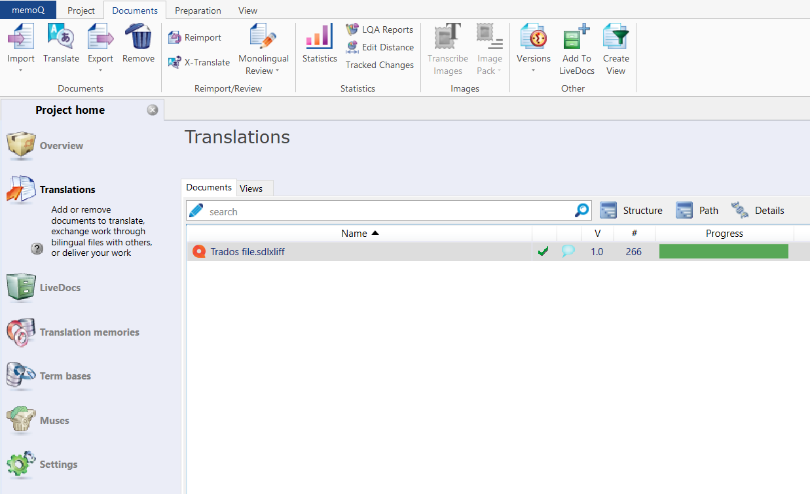
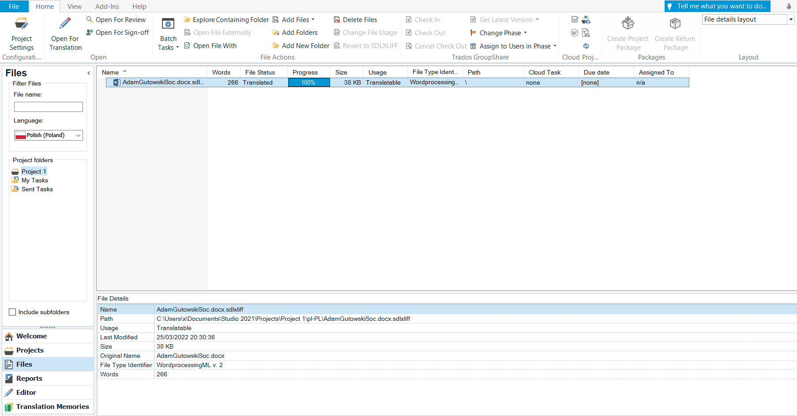

# **What are bilingual files in CAT tools**

Bilingual files are produced by CAT tools. They contain the source text and the target translation. They can be in various file formats, including .xliff and .sdlxliff. Once opened and modified in a different CAT tool, bilingual files might be exported to their original format.

# **Bilingual files in memoQ translator pro**

To go to the Translations section, open a project and click *Translations* on the left side of the screen. Then, on the top part of the screen, you can:

- click *Import* to import a file (you can also import a folder structure)
- click *Translate* to open the selected document in the translation editor
- click *Export* to save the selected document in its original format; you can also click *Export Bilingual* to export a bilingual file to an .xliff, .doc., or .rtf file
- click *Delete* to delete the selected document
- click *Reimport* to replace the selected document with an updated source document
- click *X-Translate* to restore your work after you have reimported an updated version of the source file
- click *Monolingual Review* to import a translated target language only document containing edits or corrections
- click *Statistics* to see how many words, characters, and segments there are in your documents, and learn how much of the text has already been translated
- click *Transcribe Images* to transcribe the text from a localised image
- click *Image Pack* to create or receive image localisation packs
- click *Versions* to view document history or create a new snapshot
- click *Add To LiveDocs* to store the selected translated documents in your project's LiveDocs corpus
- click *Create View* to combine or split up documents

# **Bilingual files in Trados Studio**

To go to the Files section, click *Files* on the  lower left side of the screen. Then, on the top part of the screen, you can:

- click *Open For Translation* to open the selected document for translation
- click *Open For Review* to open the selected document for review
- click *Open For Sign-off* to open the selected document for sign-off
- click *Batch tasks* to perform tasks on all applicable project files
- click *Explore Containing Folder* to open the folder containing the selected document
- click *Open File With* to choose an external program to open the selected document
- click *Add Files* to add a new document
- click *Add Folders* to add a folder
- click *Add New Folder* to create and add a new folder
- click *Delete Files* to delete the selected document
- click *Change File Usage* to change the properties of the selected document
- click *Revert to SDLXLIFF* to revert the selected document to .sdlxliff file

## **Links**

[Translation memory settings in memoQ translator pro](https://docs.memoq.com/current/en/Things/things-tm-settings.html)
