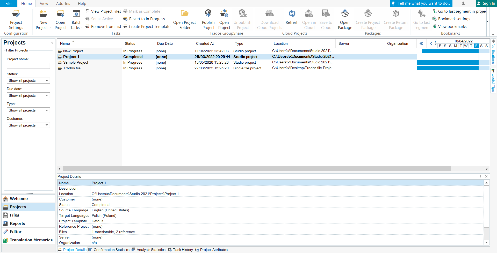

# **What are packages in CAT tools**

In CAT tools, packages are translation projects, which contain of bilingual files, translation memories, term bases, etc. Once opened and modified in a different CAT tool, package files might be exported to their original format.

# **Packages in memoQ translator pro**

To go to the Project section, simply open memoQ translator pro. Then, on the top part of the screen, you can:

- click *Open* to open the selected project
- click *Open Recent* to go to one of the five projects you most recently worked on
- click *Rename* to change the name of the selected project
- click *Manage Projects* to view all your projects in a single list and find information on them
- click *Close project* to close the project you are working on
- click *New Project* to create a new project (you can also create it from a template)
- click *Import Package* to import a package you have received
- click *Check Out From Server* to start working on a job assigned to you on a memoQ server
- click *Wrap Up* to finish the selected project by running automated actions (only works for template-based projects)
- click *Move To Recycle Bin* to delete the selected project when you no longer need it
- click *Log Time For Document* to view log time for the document that is currently active
- click *View Recycle Bin* to see the content of the Recycle Bin
- click *Back Up* to create a backup of the selected project and the resources (translation memories, term bases, etc.) it uses
- click *Restore* to restore a project and its resources from a backup
- click *Manage Logins* to view the server logins memoQ has saved for you or remove items from the list so you can connect using a different username
- click *Show Project List Only* to hide project creation commands and show only the project list

# **Packages in Trados Studio**

To go to the Projects section, click *Projects* on the left side of the screen. Then, on the top part of the screen, you can:

- click *Project Settings* to configure your project
- click *New Project* to create a new (local or cloud) project
- click *Open Project* to open a project in the .sdlproj format
- click *Batch Tasks* to perform tasks on all applicable project files
- click *View Project Files* to view project files
- click *Set As Active* to set the selected project to be the active project
- click *Remove From List* to remove the selected project from the list
- click *Mark as Complete* to mark the selected project as complete
- click *Revert to In Progress* to revert the selected project to in progress
- click *Create Project Template* to create a new project template in the .sdltpl format
- click *Open Project Folder* to open the folder with the selected project file
- click *Publish Project* to publish the selected project to a server to enable collaboration
- click *Open Project* to open a server hosted collaborative project
- click *Unpublish Project* to unpublish the project from the server
- click *Download Cloud Projects* to download cloud projects
- click *Refresh* to refresh the current list of projects
- click *Open in Cloud* to open the selected project in language cloud
- click *Save to Cloud* to save the selected project to cloud
- click *Open Package* to open a package in the .sdlppx or .sdlrpx format
- click *Create Project Package* to create a new project package
- click *Create Return Package* to create a return package

## **Links**

[Translation memory settings in memoQ translator pro](https://docs.memoq.com/current/en/Things/things-tm-settings.html)
