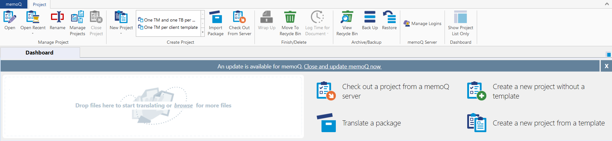

# **What are packages in CAT tools**

In CAT tools, packages are translation projects, which contain of bilingual files, translation memories, term bases, etc.

# **Packages in MemoQ Translator Pro**

To go to the Project section, simply open MemoQ Translator Pro. Then, on the top part of the screen, you can:

- click *Open* to open the selected project
- click *Open Recent* to go to one of the five projects you most recently worked on
- click *Rename* to change the name of the selected project
- click *Manage Projects* to view all your projects in a single list and find information on them
- click *Close project* to close the project you are working on
- click *New Project* to create a new project (you can also create it from a template)
- click *Import Package* to import a package you have received
- click *Check Out From Server* to start working on a job assigned to you on a MemoQ server
- click *Wrap Up* to finish the selected project by running automated actions (only works for template-based projects)
- click *Move To Recycle Bin* to delete the selected project when you no longer need it
- click *Log Time For Document* to view log time for the document that is currently active
- click *View Recycle Bin* to see the content of the Recycle Bin
- click *Back Up* to create a backup of the selected project and the resources (translation memories, term bases, etc.) it uses
- click *Restore* to restore a project and its resources from a backup
- click *Manage Logins* to view the server logins MemoQ has saved for you or remove items from the list so you can connect using a different username
- click *Show Project List Only* to hide project creation commands and show only the project list

# **Packages in Trados Studio**

To go to the Projects section, click *Projects* on the left side of the screen. Then, on the top part of the screen, you can:

- click *Project Settings* to configure your project
- click *Open* to open a new translation memory (an .sdltm file), a server-based translation memory, or a language resource template
- click *New* to create a new translation memory (an .sdltm file), a server-based translation memory, or a language resource template
- click *Import* to import a translation memory (.tmx, tmx.gz, .sdlxliff, .ttx, .itd, or .sdlalign)
- click *Export* to export a selected translation memory to a .tmx file
- click *Migrate Local TMs to Cloud* to migrate a local translation memory to a cloud server
- click *Align Documents* to select a translation memory and the documents (a single file pair or multiple files) to align, or to open an alignment file (.sdlalign)
- click *Create AutoSuggest Display* to select a translation memory and create a new AutoSuggest dictionary
- click *Commit Changes* to commit pending changes to a particular translation memory

## **Links**

[Translation memory settings in MemoQ Translator Pro](https://docs.memoq.com/current/en/Things/things-tm-settings.html)
