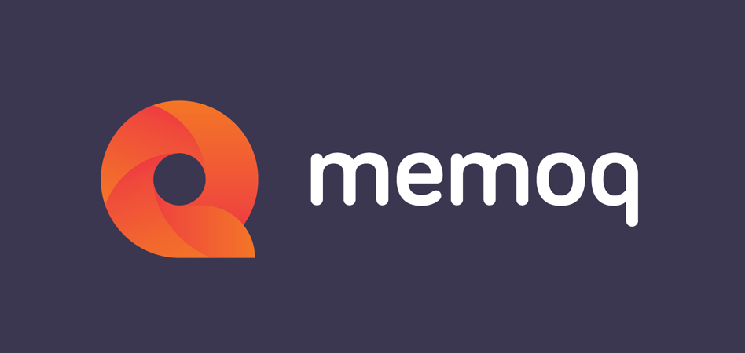

# **memoQ**

- Runs on Microsoft Windows
- Designed by translators for translators
- Increases productivity and quality of translations
- Compatible with most other translation tools
- Supports most file formats and over 100 languages
- Translation memory, term bases, predictive typing technology
- Recycling documents with the LiveDocs feature

## **Links**

[memoQ compatibility](https://www.memoq.com/products/memoq-translator-pro)

