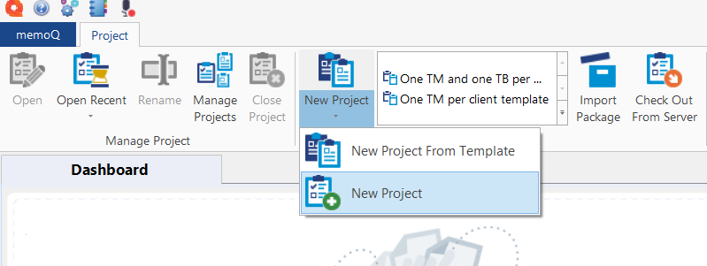
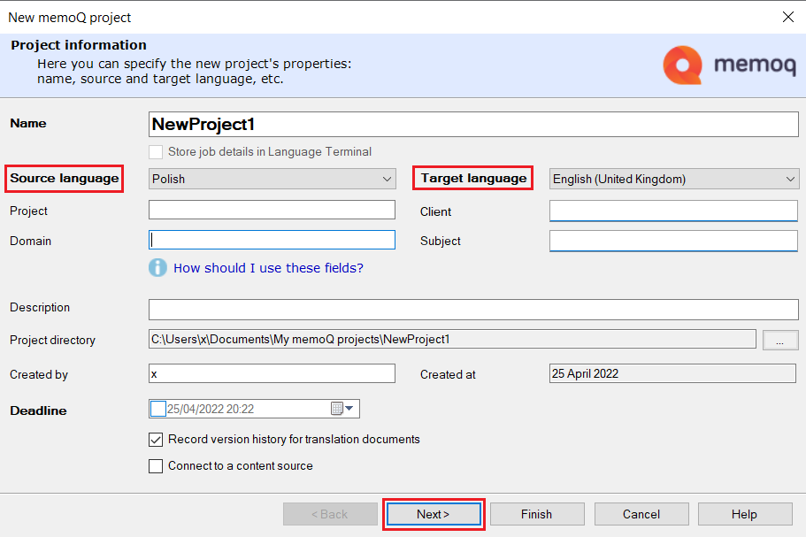
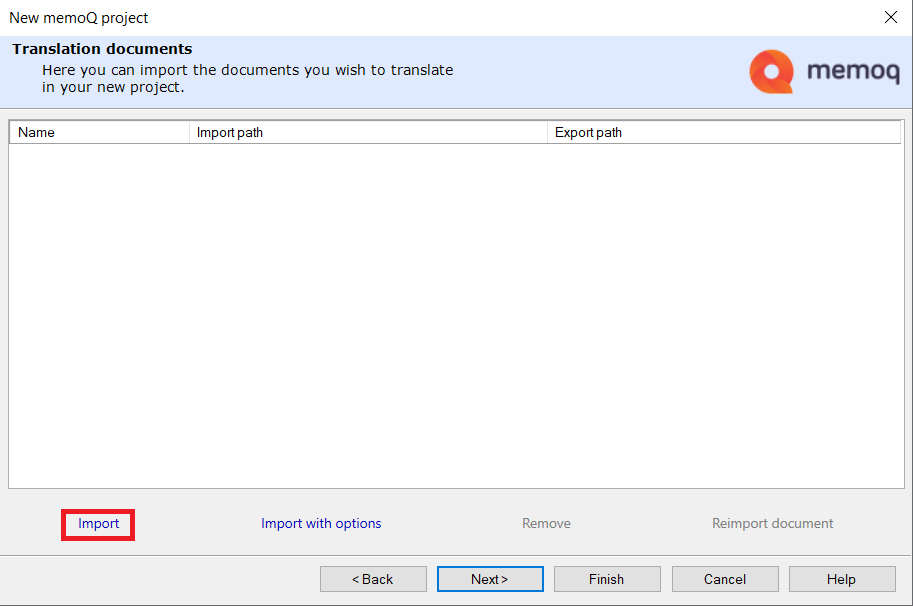
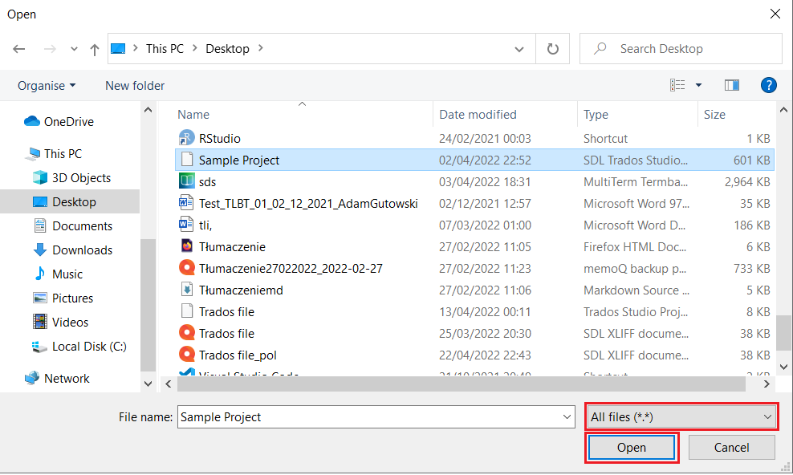
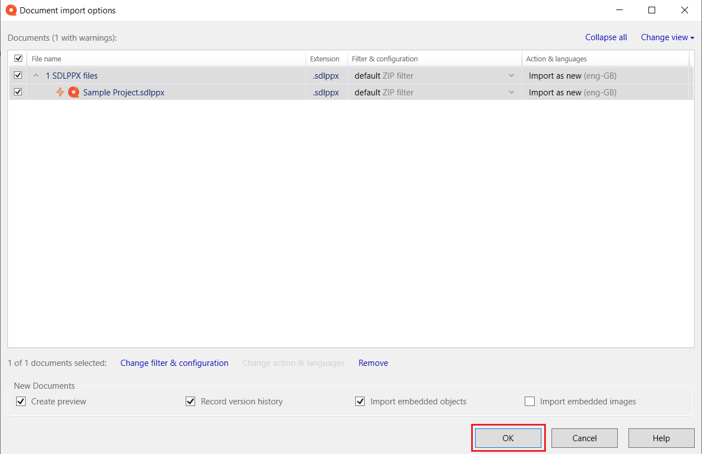
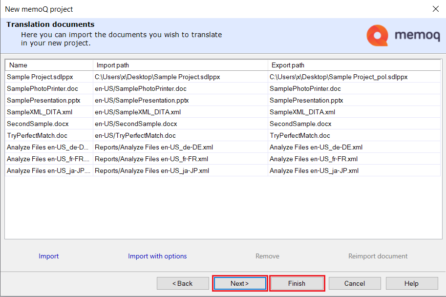
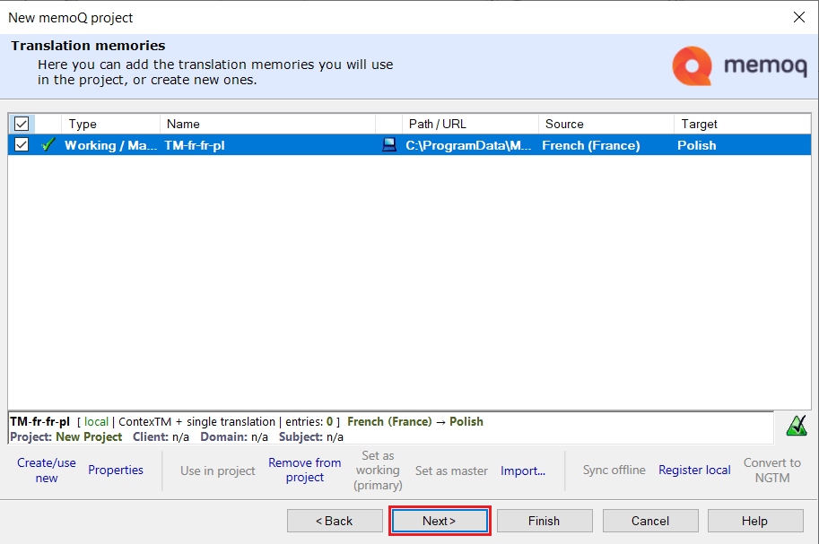
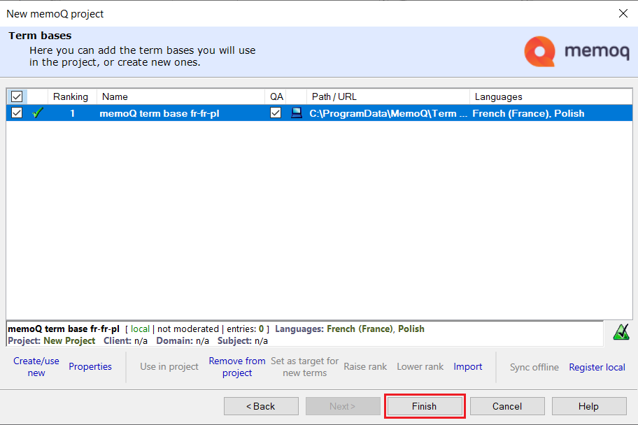

# How to open a Trados package file (.sdlppx) in memoQ translator pro

Perform these steps to open a Trados package file (.sdlppx) in memoQ translator pro:

1.	Open memoQ translator pro.

2.	Click *New Project* and select the *New Project* option to create a new project.

    

3.	Name your project, and add other information. Remember to select the source and target languages. Then, click *Next*.

    

4. 	Click *Import* to import a project.

    

5.	Select the *All files* option so that your .sdlppx file is selectable. Select it, and click *Open*.

    

6.	Click *OK*.

    

7.	Wait for the operation to finish. Click *Finish* or if you want to import translation memories and/or term bases, click *Next*.

    

8.	Select the translation memories you want to import and click *Next*.

    

9.	Select the term bases you want to import and click *Finish*.

    

10. You have successfully added the package file.