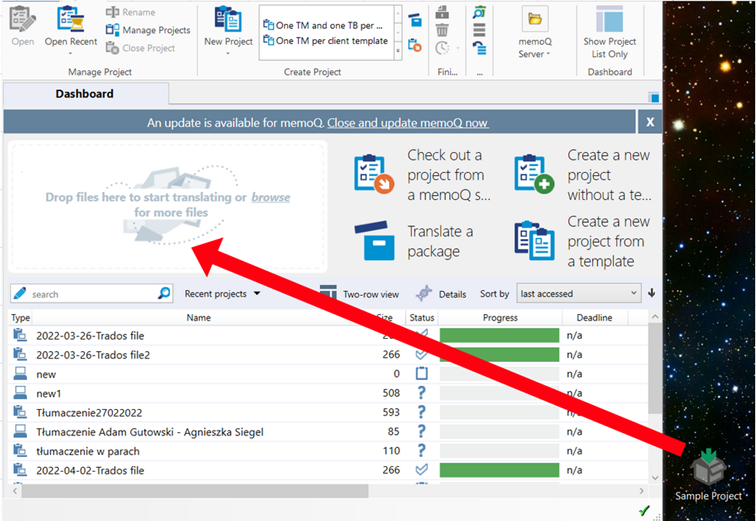
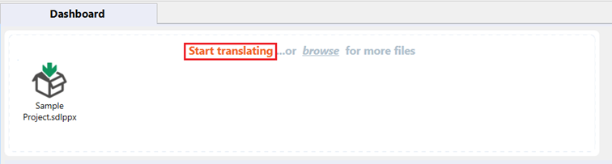
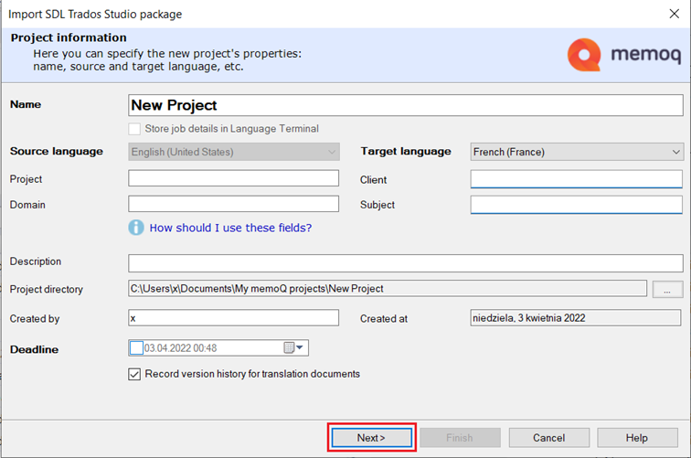
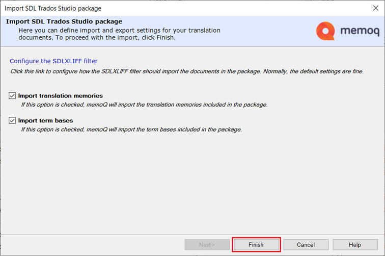
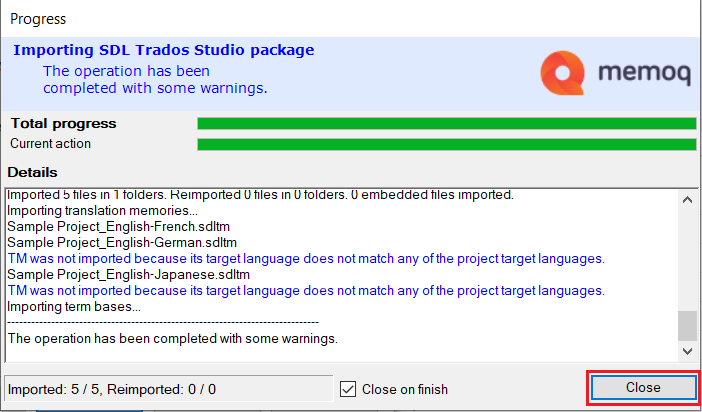

# How to open a Trados package file (.sdlppx) in memoQ translator pro

Perform these steps to open a Trados package file (.sdlppx) in memoQ translator pro:

1.	Open memoQ translator pro.

2.	Drag and drop the Trados package file (.sdlppx) that you want to use into the designated space.

    

3.	Click *Start translating*.

    

4. 	Enter the information and the target language, and click *Next*.

    

5.	Translation memories and term bases are imported by default. If you do not wish to import them, untick the boxes next to them. Then, click *Finish*.

    

6.	Wait for the operation to complete, and click *Close*.

    

7.	You have successfully added the package file.