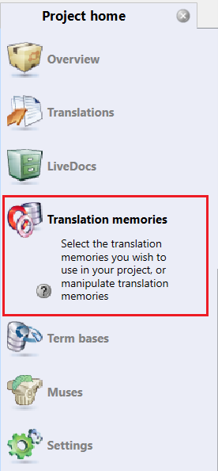
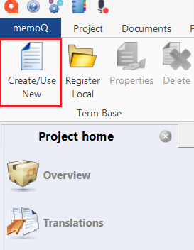
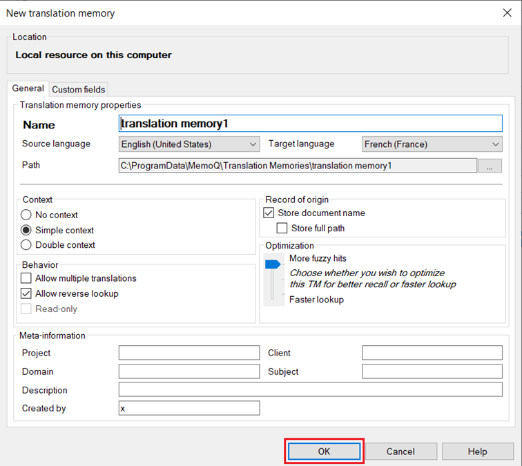
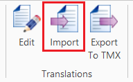
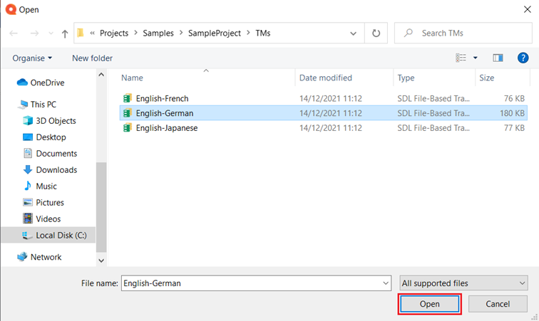

# How to open a Trados translation memory file (.sdltm) in MemoQ

1.	Open MemoQ Translator Pro.

2.  Go to the *Translation memories* section of your project to create a new translation memory.

    

3.  Click *Create/Use New*.

    

4.	Enter the information, and click *OK*.

    

5.	Select the translation memory you have created and click *Import*.

    

6.	Select the Trados translation Memory file (.sdltm), and click *Open*.

    

7.	You have successfully imported the translation memory file.

You can also import Trados translation memories to MemoQ as part of a package file (see [link]).