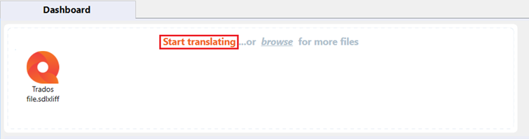

# How to open a Trados document file (.sdlxliff) in MemoQ Translator Pro

Perform these steps to open a Trados document file (.sdlxliff) in MemoQ Translator Pro:

1.	Open MemoQ Translator Pro.
2.	Drag and drop the Trados document file (.sdlxliff) that you want to use into the designated space.

    

3.	Click *Start translating*.

    

4.	Create a new project from template. Enter the information, and click *Finish*.

    

5.	Wait for the operation to complete, and click *Close*.

    

6.	You have successfully added the document file. In the Translations panel, double click it to open it.