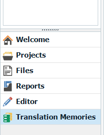
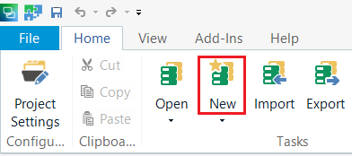
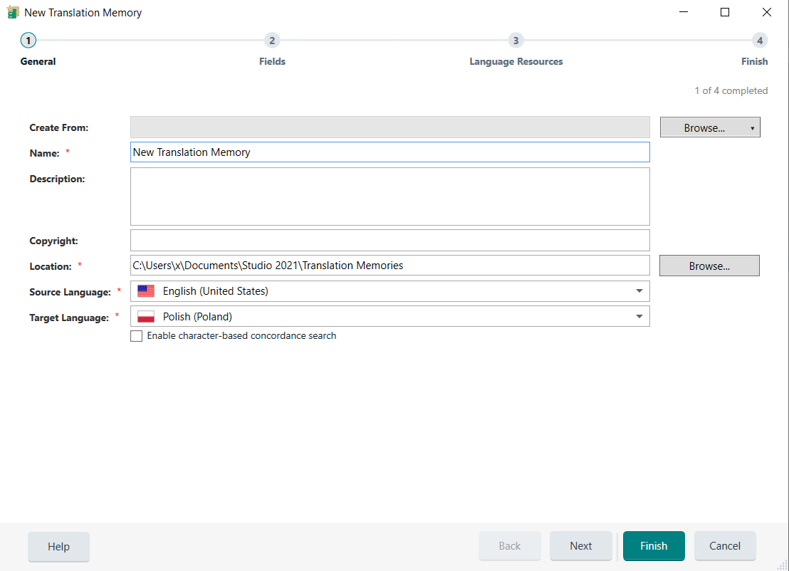
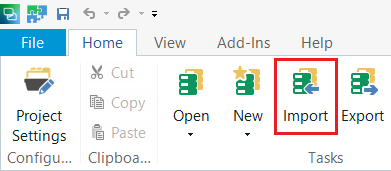
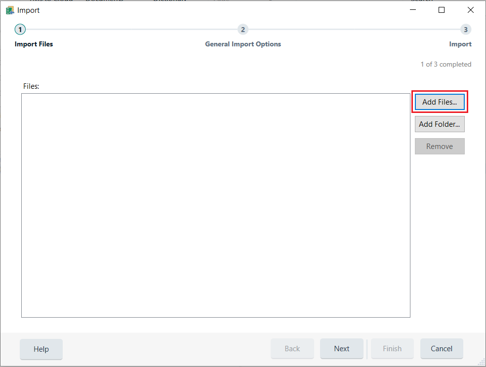
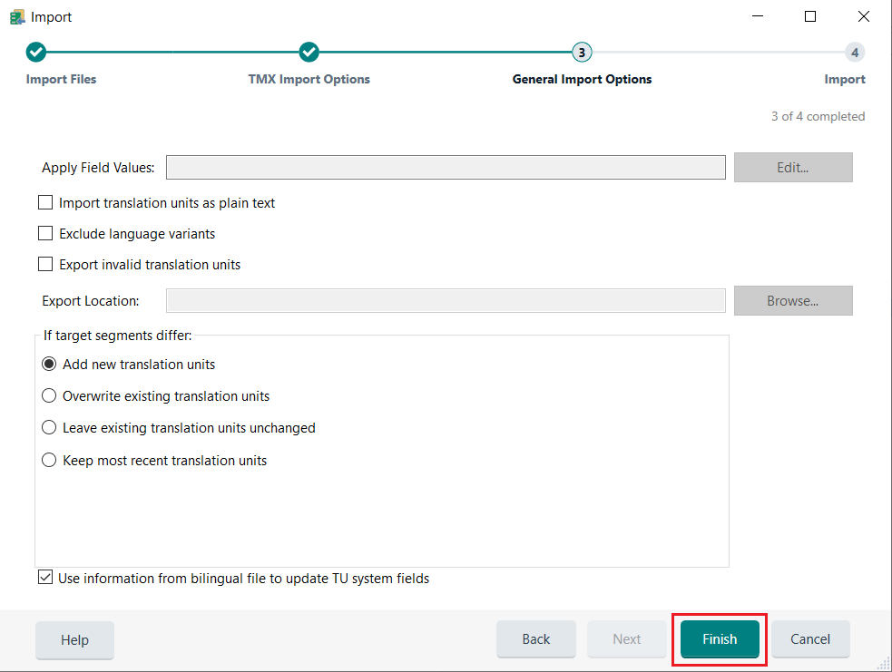

# How to open a MemoQ translation memory file (.tmx) in Trados Studio

Performs these steps to open a MemoQ translation memory file (.tmx) in Trados Studio:

1. Open a project in Trados Studio 2021.
2. Go to the *Translation Memories* section.

   

3. Click *New* to create a translation memory.

   

4. Enter the information, and click *Finish* and then *Close*.

   

5. You have created a translation memory. Now click *Import*.

   

6. Click *Add files...* 

   

7. Select the .tmx file you want to import, and click *Open*.
8. Click *Next* to go to the *TMX Import Options* section, where you can add information.
9. Click *Next* to go to the *General Import Options*, where you can add information.
10. Click *Finish*.

   

11. You have successfully imported the translation memory file.