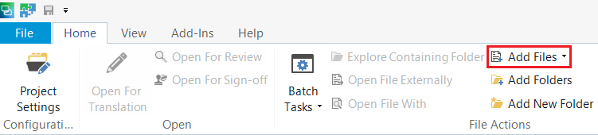

# How to open a MemoQ text file (.mqxlz) in Trados Studio 2021

1. Open a project in Trados Studio 2021.
2. Click *Add files*.

   

3. Select the .mqxlz file you want to use, and click *Open*.
4. You have successfully added the text file. Double click it to open it.