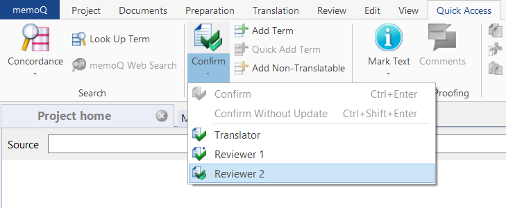

Here you will learn how to import files created using memoQ translator pro 9.10 to Trados Studio 2021 and the other way round.

**Note:** Remember that there are further differences between files in memoQ translator pro 9.10 and Trados Studio 2021 to consider when importing them. For example, while in Trados Studio, changes in text files are tracked by default, in memoQ translator pro, you need to click *Confirm* and select *Reviewer 2* to do that.

