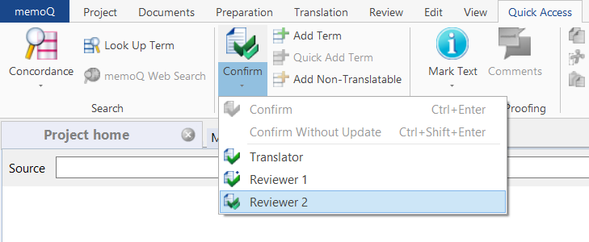

Here you will learn how to import files created using memoQ translator pro 9.10 to Trados Studio 2021 and vice versa.

 > :memo: **Note:** Remember that there are more differences between files in memoQ translator pro 9.10 and Trados Studio 2021 to consider than covered by this User Guide. For example: in Trados Studio, review changes in files are tracked by default, while in memoQ translator pro, you need to click *Confirm* and select *Reviewer 2* to have changes tracked.

