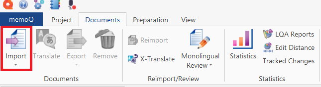
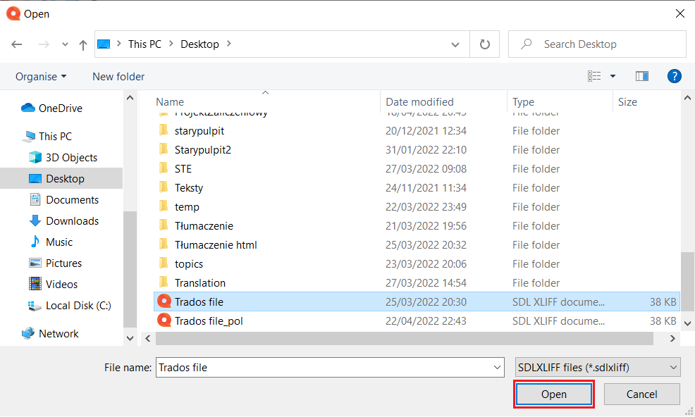

# How to open a Trados bilingual file (.sdlxliff) in memoQ translator pro

Perform these steps to open a Trados bilingual file (.sdlxliff) in memoQ translator pro:

1.	Open memoQ translator pro.
2.	Open the project you want to import the file into.
3.  In the Translations section, click *Import* to import the file.

    

4.	Select the .sdlxliff file you want to import, and click *Open*.

    

5.	Wait for the operation to complete, and click *Close*.

    

6.	You have successfully added the bilingual file. In the Translations panel, double click it to open it.