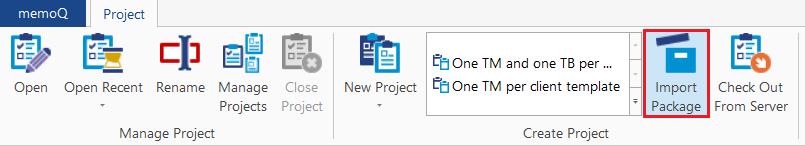
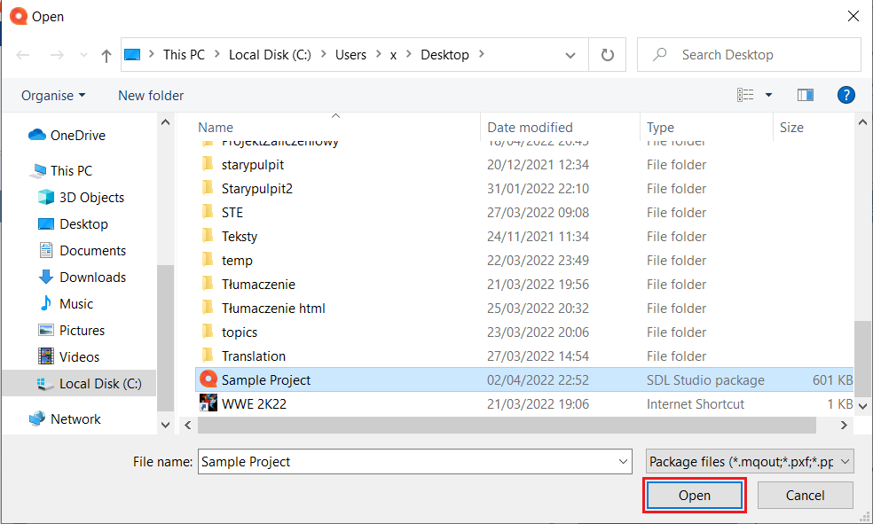
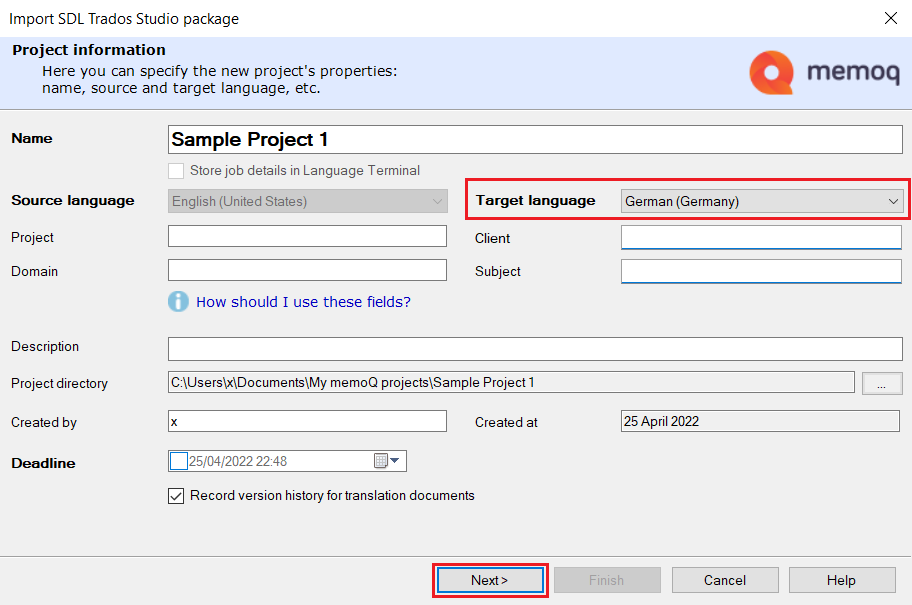
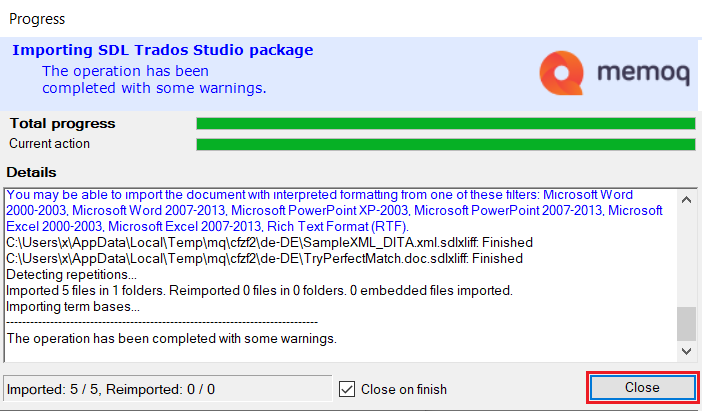

# How to open a Trados package file (.sdlppx) in memoQ translator pro

Perform these steps to open a Trados package file (.sdlppx) in memoQ translator pro:

1.	Open memoQ translator pro.

2.	In the Project section, click *Import Package*.

    

3.	Select the .sdlppx file you want to import, and click *Open*.

    

4. 	Name your project, and add other information. Select the target language of the project. Also, here you can change the name of your the project. Then, click *Next*.

    

5.	Here you can decide if you want to import the translation memories and term bases that are part of the project. Then, click *Finish*.

    

6.	Wait for the operation to finish. Click *Close*.

    

7.  You have successfully imported the package file.