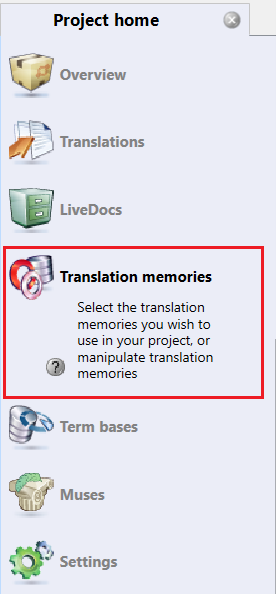
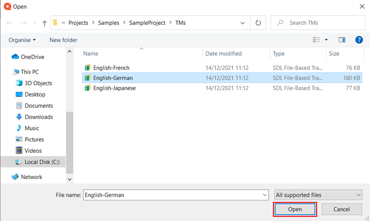

# How to import a Trados translation memory file (.sdltm) into memoQ translator pro

Perform these steps to import a Trados translation memory file (.sdltm) into memoQ translator pro:

1.	Open memoQ translator pro.

2.  Go to the *Translation memories* section of your project to create a new translation memory.

    

3.  Click *Create/Use New*.

    

4.	Enter the information, and click *OK*.

    

5.	Select the translation memory you have created and click *Import*.

    

6.	Select the Trados translation memory file (.sdltm or .tmx), and click *Open*.

    

7.	You have successfully imported the translation memory file.

**Note:** When importing a Trados translation memory file you might get a message about the languages not matching because Trados Studio requires a specified language variant (e.g. English (United States), while memoQ does not. In such case, click *Import*.

You can also import Trados translation memories into memoQ as part of a package file (see [here](https://adgut1509.github.io/ProjektZaliczeniowy/docs/parent4/UGchild1/grandchild1.html)).